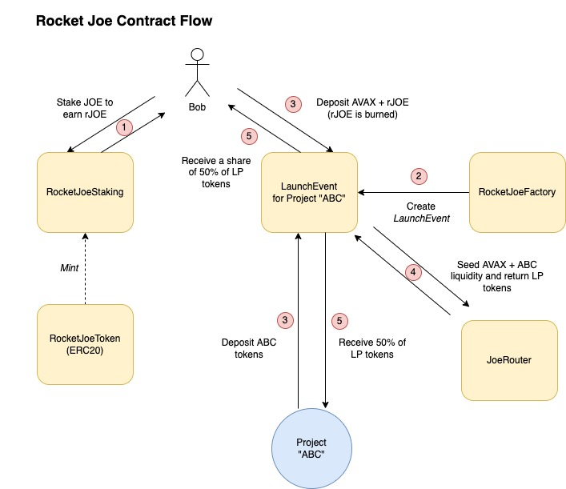

# Trader Joe contest details

- $45,000 main award pot
- $2,500 gas optimization award pot
- Join [C4 Discord](https://discord.gg/code4rena) to register
- Submit findings [using the C4 form](https://code4rena.com/contests/2022-01-trader-joe-contest/submit)
- [Read our guidelines for more details](https://docs.code4rena.com/roles/wardens)
- Starts January 25, 2022 00:00 UTC
- Ends January 27, 2022 23:59 UTC

# Rocket Joe

_Rocket Joe_ is a token launch platform where participants bid to provide liquidity for newly issued tokens. The platform enables price discovery and token distribution over a period of time before tokens are issued to public market, while discouraging front-running by bots. In addition, it improves liquidity sustainability by allowing issuing protocols to acquire its own token liquidity.

Full whitepaper available [here](https://github.com/traderjoe-xyz/research/blob/main/RocketJoe_Launch_Platform_for_Bootstrapping_Protocol-Owned_Liquidity.pdf).

## How It Works

- User stakes JOE into the RocketJoeStaking contract to earn rJOE.
- LaunchEvent is created with a fixed amount of tokens to be issued.
- Users can deposit AVAX and rJOE into the LaunchEvent contract. The amount of rJOE needed to deposit a certain amount of AVAX is dictated by the parameter `rJoePerAvax`, which may vary from launch event to launch event.
- Users can also withdraw AVAX (if they think the price of TOKEN/AVAX is too high), but a withdrawal penalty may be incurred depending on which phase the launch event is at:

| Phase One  |                                   | Phase Two   | Phase Three                                |
| ---------- | --------------------------------- | ----------- | ------------------------------------------ |
| 0-24 hrs   | 24-48 hrs                         | 48-72 hrs   | Additional 3-7 days                        |
| 0% penalty | 0-50% penalty (linear increasing) | 20% penalty | LPs are locked + bonus incentives received |

- **Phase One**:
  - 0-24 hrs: Users can deposit and withdraw AVAX without any penalty.
  - 24-72 hrs: Users can continue to deposit and withdraw AVAX, but must incur a withdrawal penalty that increases linearly from 0-50%.
- **Phase Two**: Users can _only_ withdraw AVAX with a 20% penalty.
- **Phase Three**: Initial liquidity is seeded, but the LP tokens are locked for an additional 3-7 days. As an incentive for locking, participants receive a bonus percentage of tokens once phase three starts. After this phase, both user and issuer are free to claim their LP tokens.

## Contracts



###### RocketJoeToken

- 67 lines
- External contracts called: RocketJoeFactory
- Libraries used: ERC20, Ownable

An infinite supply ERC20 token that is an allocation credit for users to participate in a Launch Event. The amount of rJOE required to deposit an amount of AVAX into a launch event is dictated by `rJoePerAvax`, which is set manually on RocketJoeFactory. Once AVAX is deposited, rJOE is burned.

rJOE is also designed to be non-tradeable; we enforce this by defining our own `_beforeTokenTransfer` function in which you can only mint or burn but not transfer.

###### RocketJoeStaking

- 178 lines
- External contracts called: RocketJoeToken
- Libraries used: Initializable, OwnableUpgradeable, SafeERC20Upgradeable, IERC20Upgradeable

A MasterChef-style staking contract in which users stake JOE to earn rJOE.

###### RocketJoeFactory

- 245 lines
- External contracts called: RocketJoeToken, LaunchEvent, JoeFactory, JoeRouter, WAVAX
- Libraries used: Clones

Creates individual LaunchEvent contracts. Also sets `rJoePerAvax`.

###### LaunchEvent

- 621 lines
- External contracts called: RocketJoeToken, RocketJoeFactory, WAVAX, JoeRouter, JoePair, JoeFactory
- Libraries used: Ownable, IERC20Metadata

Contract in which price discovery and token distribution takes place. Issuer deposits the issued tokens and users deposit and/or withdraw AVAX during a 72 hour period. The final amount of AVAX at the end of this period dictates the TOKEN/AVAX price which will be used to the seed initial liquidity on the Trader Joe.

## Installation

The first things you need to do are cloning this repository and installing its
dependencies:

```sh
yarn
```

## Testing

To run the tests run:

```sh
make test
```

There is a pending bug with `solidity-coverage`. To get around this bug, you must manually edit `node_modules/solidity-coverage/plugins/hardhat.plugin.js` according to these [edits](https://github.com/sc-forks/solidity-coverage/pull/667/files).

Then to run coverage:

```sh
make coverage
```

The coverage report will then be found in `coverage/`.

## Deployment

### Rinkeby

To deploy to the [rinkeby network](https://www.rinkeby.io/) you need to set appropriate environment variables. The file [.env.example](.env.example) contains examples of the variables you need to set. For convenience you can copy this file to a file name _.env_ and use a tool like [direnv](https://direnv.net/) to automatically load it.

You could then deploy to rinkeby by using [hardhat-deploy](https://github.com/wighawag/hardhat-deploy) with this command `yarn hardhat deploy --network rinkeby`.
